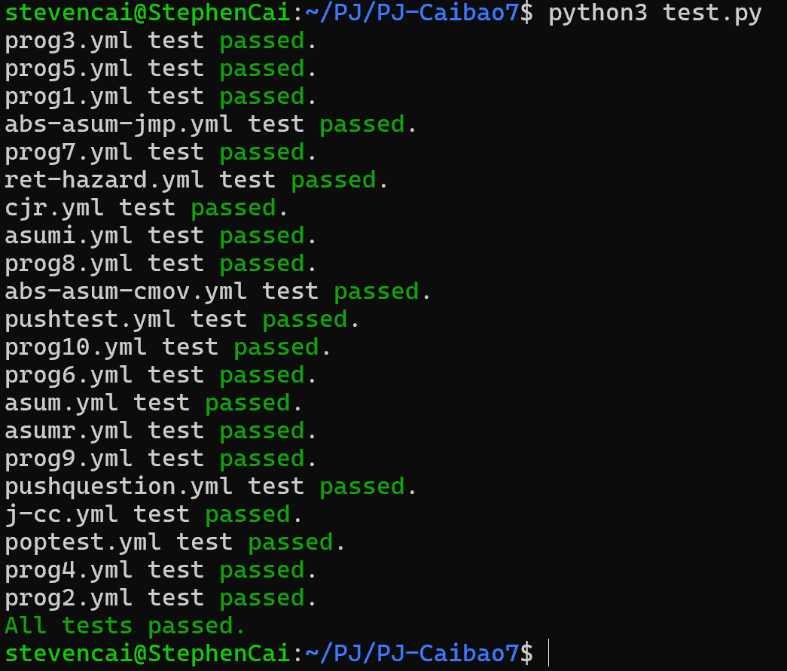

# PJ报告：Y86CPU  
**姓名**：蔡亦扬  
**学号**：23307130258  
##  成功截图  
  
## CPU设计  
### 基本架构  
- 采用单周期CPU，处理Y86指令集。  
- 编写了CPU类和Memory类来管理CPU和内存的状态。CPU类中包含寄存器、PC、条件码和状态码，以及更新条件码和计算cnd的函数。Memory类中包含内存数组，以及从文件加载数据到内存，读取和写入内存的函数。  
- 每个周期分为取指、译码、执行、访存、写回、更新PC六个阶段，通过六个函数实现。  
- 主函数定义了几个val，用来模拟数据的传递。通过循环不断执行六个阶段，循环条件为PC不越界并且条件码为1。  
### 六个阶段函数  
- fetch: 根据PC从内存读取，得到icode和ifun。根据icode的值switch case，得到相应数据以及指令长度。  
- decode: 由寄存器的标号赋值给valA和valB，实现从寄存器文件读取数据的操作。    
- execute: 根据icode的值进行相应运算，赋值给valE。OPq操作需要根据ifun的值进行switch case，运算后更新状态码。  
- memory: 内存的读取或写入。    
- write_back: 写回寄存器文件。  
- update_PC: 除去个别跳转指令，其它的更新PC为valP。  
### 创新点  
1. 扩充指令集：  
- 仍然使用OPq的icode(6)，扩展ifun，ifun为4,5,6分别对应mulq, divq, remq。在execute阶段，补充对应分支的计算逻辑；在CPU类的更新条件码函数，补充对应分支的溢出逻辑；除数为0的处理——更新状态码为3。  
- 编写了测试用例(testOfcyy目录下的cyytest.yo)，测试了更新后的OPq的所有运算指令。测试的输出是正确的(outputOfcyy目录下的cyytest.yml)。  
2. 缓存模拟：  
- 定义了cache的结构与类。使用LRU策略；参数设置为s(2), E(4), b(16)，参数的定义同cache lab；类中有更新状态，计算缓存命中率与缓存替换率的函数。  
3. CPU性能报告：  
- 性能报告包含所有OPq的指令执行次数，以及cache的情况(由于每条指令执行的时间差不多，所以报告没有给出时间，可以使用对每条指令设置固定时长的延迟来计算时间)。报告的.txt文件输出到performance目录下。  
- 可视化：编写脚本visualize_performance.py，将performance目录下的.txt文件分别画了饼状图和柱状图，输出在performance目录的images目录下。  
4. Debug辅助工具：  
- 编写了debug_compare.py，可以比较两个.yml文件，通过储存行与键值对的方式。若有不同，输出两个文件中不同的行与不同的内容。  
## 代码运行方式  
1. 在y86cpu.cpp中修改输入输出文件的路径即可，文件路径变量在主函数开头，使用###标记了(第三个变量为性能报告路径变量，如不需要可不管)。然后编译运行即可。编写了Makefile。  
2. 如需要使用debug_compare.py和visualize_performance.py，则同样修改这两个文件中的文件路径变量。文件路径变量都用###标注了方便寻找。  