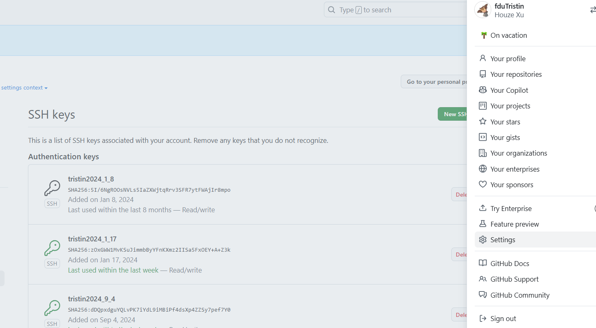
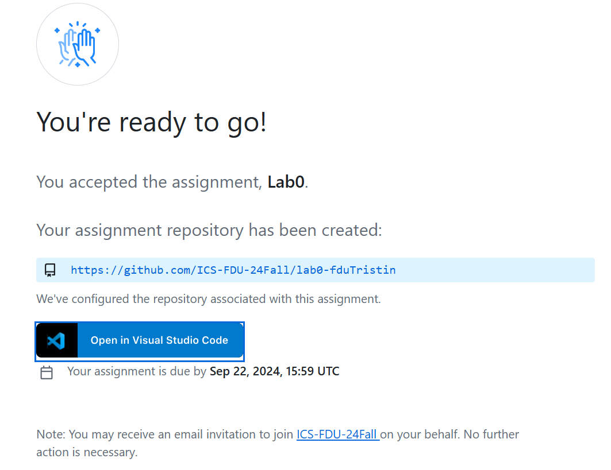

[](https://classroom.github.com/a/S5MWFPp9)
[](https://classroom.github.com/online_ide?assignment_repo_id=16031959&assignment_repo_type=AssignmentRepo)
# Lab0 -- GitLab

## 实验介绍

* 你需要学会使用一些基本的 git 功能。
* ~~这个实验非强制性要求~~，但学会使用 git 是大有裨益的

## To-Do List

* git 与 github 基础相关：
  * 在 wsl（或你使用的其他虚拟机）中安转 git
  * 在 wsl 中配置 ssh key
  * 创建 github 账号
  * 为 github 账号添加 wsl 的 ssh key

* github classroom 相关（也是今后 lab 的发布与提交流程）：
  * 在 github classroom 中接受作业
  * 将作业内容 clone 至本地（虚拟机）
  * 修改本地仓库，上传一个文件，并推送至远程仓库

* （非必需，但推荐）简单学习一下 git 的常用指令

* **完成本次作业需要一次成功的commit，提交内容见下文**

## 实验指引

* git 的安装
  
  * 参考[这个网站](https://git-scm.com/book/zh/v2/%E8%B5%B7%E6%AD%A5-%E5%AE%89%E8%A3%85-Git)

  * 本课程只需要在linux环境下安装git，具体流程为：
    * 打开终端，更新软件包列表：

      ```bash
      sudo apt update
      ```

    * 安装 Git：

      ```bash
      sudo apt install git
      ```

    * 验证安装是否成功：

      ```bash
      git --version
      ```

* 你需要注册一个 [github](https://github.com/) 账号
* github 配置 **ssh key**

  **NOTE:** 由于我们的实验都在虚拟机 linux 环境下进行，所以无需为本地主机配置 ssh key。如果你以后希望将本地的仓库推送到远程，只要在本地的终端进行下面的配置。
  
  * 1.打开 wsl
  * 2.检查是否已经存在 ssh key。终端运行：
  
    ```shell
    ls ~/.ssh
    # 列出 ~/.ssh 目录下的所有内容，相当于查看 ~/.ssh 目录是否存在
    ```
  
    如果输出如下， 则跳到第 4 步
  
    
  
    若显示 `No such file or directory`，则继续进行第 3 步
  
  * 3.生成 ssh key。终端运行
  
    ```shell
    ssh-keygen -t rsa -C "xxx@xx.com"
    # 引号以及里面的内容替换为你的邮箱
    # 执行后一直回车使用默认值即可（没必要设置密码）
    ```
  
  * 4.获取 ssh key 公钥内容（id_rsa.pub）
  
    ```shell
    cat ~/.ssh/id_rsa.pub
    # cat 命令用于连接文件并打印到标准输出设备
    ```
  
    如下图所示：
  
    
  
    复制该内容（从 ssh-rsa 开始）
  
  * 5.github 账号上添加公钥
    * 点击进入 settings - SSH and GPG keys
  
    
  
    * 点击 "New SSH keys"，将刚刚复制的公钥粘贴，并给它起个名字，例如 wsl-key
  * 6.验证是否成功
  
    
  
* 进入课堂

  * 点击加入 [github classroom](https://classroom.github.com/a/S5MWFPp9)

  * 你将显示如下页面：
  

  * 选择和你对应的学号/姓名

  * 完成后：
  

  * 这个链接是你的远程仓库（你只能访问自己的，需要保持 github 的登录状态）

* 创建本地仓库（你也可以直接点进链接，直接更新远程仓库，但是推荐使用本地仓库）
  * 打开 wsl，新建一个 lab 文件夹

    ```shell
    cd ~
    # 进入默认文件夹
    mkdir lab0
    # 创建名为 lab0 的文件夹（你也可以在此之前创建一个总的课程文件夹，进入之后创建每个 lab 的文件夹）
    cd lab0
    # 进入 lab0 文件夹
    ```
  
  * 在网页中访问刚刚获取的链接，点击 "Code" 下的 "SSH"，复制

    

  * 运行

    ```shell
    git clone xxxx
    # (将 xxxx 替换为刚刚获取的 SSH)
    # git clone 指令用于将远程仓库克隆到本地
    ```

    

    你会发现当前目录下有一个文件夹

      
  
  * **NOTE:** 如果你是第一次使用git，你需要配置你的用户信息：

    ```bash
    git config --global user.name "你的姓名"
    git config --global user.email "你的邮箱地址"
    ```

    * `user.name`：设置提交者的姓名。
    * `user.email`：设置提交者的邮箱。

    例如：

    ```bash
    git config --global user.name "Li Hua"
    git config --global user.email "lihua@example.com"
    ```

* 修改本地仓库（vscode 打开）
  
  * 你需要成功上传一个文件，格式为.pdf/.md，内容可以是对这门课的期待~~或者是一只猫猫？~~

* 上传！
  * 你需要先在终端进入克隆下来的文件夹
    

  * 在终端运行以下指令：

    ```shell
    git add -A
    # 提交当前文件夹下的所有更改到暂存区
    git commit -m "xxx(可以是你的提交注释)"
    # 将暂存区的所有更改提交到本地仓库
    git push
    # 将本地仓库推送到远程
    ```

  * 你也可以使用 vscode 自带的提交功能

* 在这里简单介绍一下 git 的功能：
  * git 是一种**分布式版本控制系统**，可以记录文件的不同版本，方便阶段性保存、回滚等操作，也能确保团队中的多人可以同时在同一项目上工作而不冲突。
  * 在 git 中，工作区、缓存区和本地仓库是三个核心概念，它们共同构成了 git 的版本控制流程。
    * **工作区**是实际操作项目文件的地方，可以在这里编辑、删除或添加文件。当你对文件进行修改后，这些更改首先出现在工作区中。此时，文件处于“未跟踪”或“已修改”的状态，git 并未正式记录这些修改。
    * **缓存区**是一个临时存储区，记录你希望包含在下一个提交（commit）中的更改。也就是说，文件从工作区进入缓存区后，git 会认为这些更改已经准备好被提交。
    * **本地仓库**是你项目的完整历史记录库。每次提交（commit）都会将缓存区的内容永久保存到本地仓库中。提交后，这些修改就会成为项目历史的一部分。
    * 另外还有**远程仓库**（如 github）。本地仓库的提交可以推送（push）到远程仓库中，与其他开发者共享。

## #参考资料

* [github classroom 的使用](https://www.bilibili.com/video/BV12L41147r7?vd_source=4c29bc15f944e68c9ed01279da29e70e)

* 更多的 git 操作可以参考 lab 文档下的 `Git 基本使用` 或 [这个链接](https://www.fducslg.com/git-and-github/)