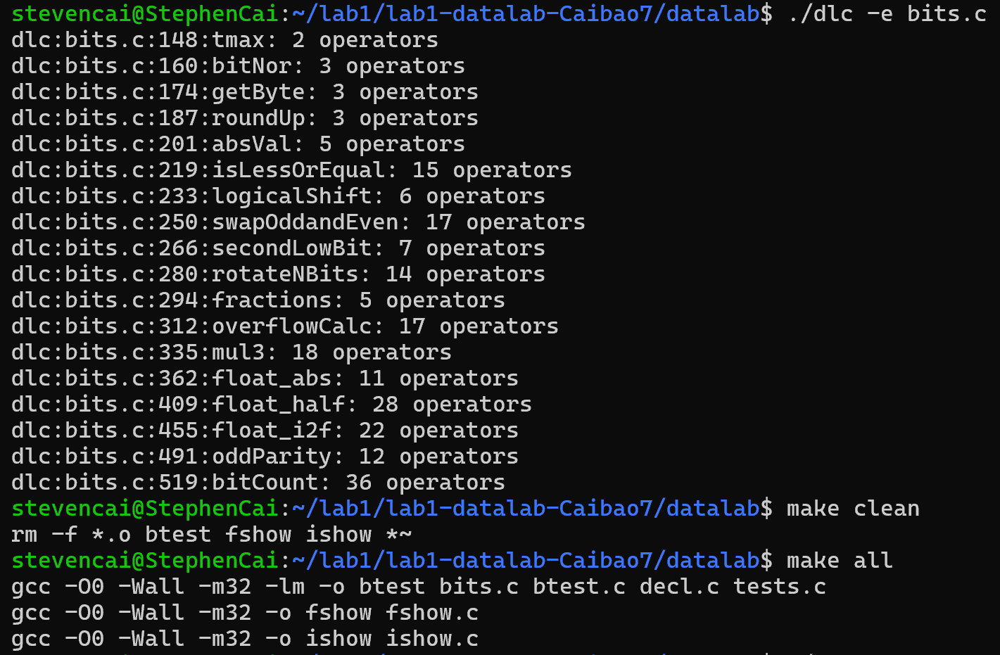
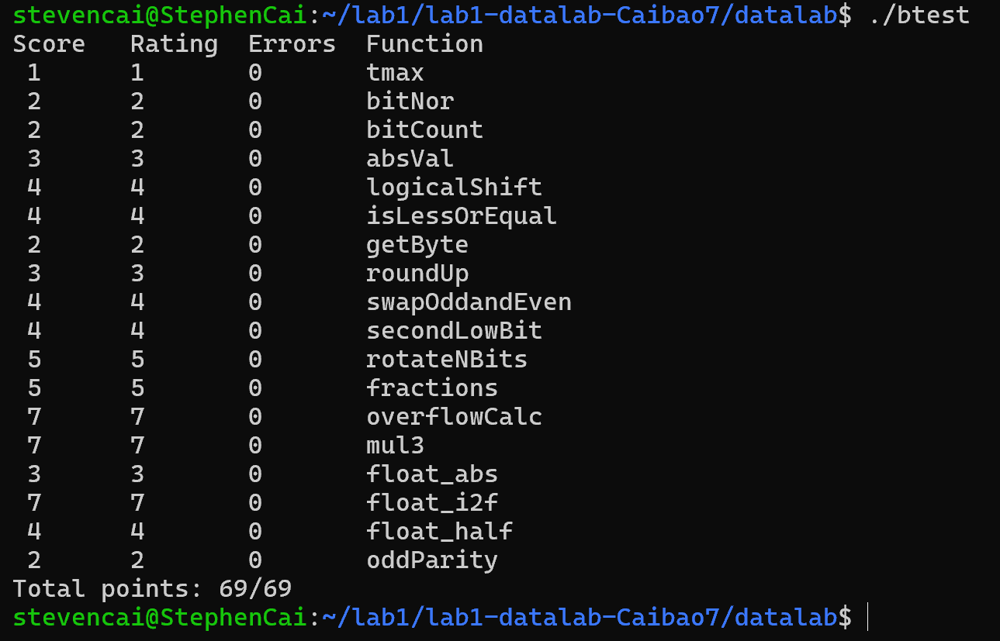

# datalab实验报告  
**姓名**：蔡亦扬  
**学号**：23307130258  
  
## 终端截图  

  
## 函数思路  
**P1**：int可表示的最大整数，在32位计算机上为011...1(31个1)，只需要将1通过位运算左移31位后，取反即可。  
  
**P2**：由摩根定理，~(x|y) = ~x & ~y, 因此返回~x & ~y即可。  
  
**P3**：1. 得到目标byte：要获得第n个byte的内容，我们需要把x的第n个byte移动到最低的byte，即对x进行右移的位运算，移动的位为n*2**3即n*8。8n的值可以由n<<3得到。我们不关心右移为逻辑右移还是算数右移，因为只用处理最低的byte。2. 最后的返回值为x & 255, 即x & 11111111(更高的位被处理成0)。  
  
**P4**：要将x舍入成大于x的最近的一个256的倍数，可以先将x + 255, 然后让x & ~255，这样可以保留高24位，舍弃低8位，完成舍入。  
  
**P5**：由于不能使用if语句进行条件判断，我们要在表达式里同时体现出正数的情况和负数的情况。首先获取掩码：将x算术右移31位，获取符号位。如果x是负数，掩码mask就会是全1；如果x是正数，mask就会是0。接着对于return的值，(x ^ mask) + (~mask + 1)，若mask为全1，第一个括号相当于对x取反，第二个括号会对x加1；若mask为0，第一个括号对全1异或，什么也不做，第二个括号会溢出，最后的结果是什么也不做。  
  
**P6**：考虑y - x再判断符号位，但这样可能有问题——溢出。所以先判断符号是否相同，符号不相同的话如果y正x负则返回1，y负x正返回0；符号相同的话，不会溢出，判断y - x(即y加上x的取反加一)的符号位，符号位为0返回1，符号位为1返回0。  
  
**P7**：为了实现逻辑右移，需要构造一个最高的n位为0，其余为1的掩码。可以让1先左移31位抵达最高位，然后再让它右移n位，此时会补出n位1，加上原有的1位，最高的n+1位都是1。接着再左移1位，这样就得到了最高n位为1，其余位为0的数，取反即可得到掩码。最后让掩码按位与x算术右移n位的结果即可。  
  
**P8**：所谓的odd和even的交换可以分成两部组合而成：现将x左移1位得到tl，有最后的奇数位的信息；再将x右移1位得到tr，有最后的偶数位的信息。需要只保留奇数和偶数的操作要由掩码实现。oddMask为1010...，和tl按位与将偶数位置0，同理使用evenMask将tr的奇数位置0，最后通过按位或操作将两者拼接即可。  
  
**P9**：为了获取第二低有效位1，我们先获取最低有效位：这个操作可以通过x与自己的补码按位与来实现，结果存为lowest1。之后再对x与lowest1进行异或操作去掉当前这个最低有效位。最后再执行一次找最低有效位的操作即可。  
  
**P10**：由于题目只显示n >= 0，故我们先对n进行取余(n = n & 31)，确保n在0到31之间。接着将x左移n位和x右移32-n位的结果用按位与拼接起来(注意应该使用逻辑右移，逻辑右移已由P7实现)。  
  
**P11**：要计算*7/16，我们需要先完成乘7的操作，再完成除16的操作。乘7的操作可以由4x + 2x + x实现(乘4与乘2左移即可)；除16的操作可以由右移4位实现。右移操作在整数运算中对正数执行时，会自动实现向下取整的效果。这是因为右移操作丢弃的是最低位，相当于向下舍入。  
  
**P12**：三个数相加捕获进位可以分成两步：两个数先相加捕获进位，再让结果与第三个数相加捕获进位，最后相加两个进位即可。捕获进位的操作(以x + y为例，第二步用sum1和z重复这一步操作即可)：carry1 = ((x & y) | ((x ^ y) & ~sum1)) >> 31 & 1;  
(x & y)：当 a 和 b 的对应位都为1时，该位才为1，这捕获了同时为1的位，这些位在相加时一定会产生进位。  
(x ^ y)：异或操作，得到 a 和 b 不同的位。  
~sum1：对 sum1 取反。  
((x ^ y) & ~sum1)：捕获在相加过程中由于进位导致的新的进位。  
将以上两部分结果按位或，得到所有可能的进位位。核心思路在于：有两种情况会溢出。一是32位两个都是1，那一定溢出；二是32位有一个数是1，但计算x + y的结果在32位也是1，这样也会溢出32位。    
右移31位再按位与1，存下进位的值。  
  
**P13**：检测溢出：由于*3的操作由两步完成(左移一位和加上自身)，故需要两次检测是否溢出，最后只要有一步发生溢出就会最后判定为溢出，标志overflow会被设成全1，否则为0。检测溢出的逻辑在于符号位是否相同，用异或来判断。溢出情况下，输出值of_value要根据原来的符号sign来判断最后输出INT_MAX还是INT_MIN。最后根据overflow的情况决定最后输出正常运算的结果还是of_value。  
  
**P14**：为了计算uf的绝对值，首先我们应该将最高位置0得到uf_abs。接着我们要判断返回值是否为NaN：利用掩码分别提取出exp和frac。如果exp全为1而frac不等于0则为NaN，需要返回uf，否则返回uf_abs。  
  
**P15**：需要把这个问题分成三种情况：  
如果是Infinity或者是NaN，返回自身。  
如果是exp大于1的标准化，直接在指数位上减一即可，即让exp减一。  
如果是exp为1或0的情况，需要考虑舍入的问题，因为这两种情况对应两种指数的编码方式，但这两种情况对应的值是一样的，此时无法在指数位上直接减1了。如果exp为1，还要考虑frac部分编码方式的变化，注意要手动给frac最高位加上1。
    
**P16**：把这个问题分成四步：  
获取符号位。利用掩码很容易获得。把x取绝对值方便后续处理。  
获取exp。对于整数转换为浮点数，真实指数 E 等于最高有效位的位置（比最高有效位低的位置，可以由后面frac乘2**E得到）。所以我们应该去寻找x最高有效位的位置，利用循环和计数器shift实现。  
获取frac。前面已经把最高有效位移动到了31位（即最高的位置上），由于规格化的尾数M被定义为1 + f，所以我们不需要存储最高有效位这个1，那么从下一位（即30位）开始，存储23位作为frac，也就是说存储第8位到第30位，考虑右移8位存储即可。  
舍入。浮点数的尾数部分只有 23 位，但整数可能超过 23 位（最高可达 31 位），所以需要舍入。我们需要对右移掉的那8位数进行判断，看其是否需要舍入。首先右移掉的8位数（即abs_x的后8位）的最高位一定要是1，才会考虑舍入。接着有两种情况：一是后面还有1，那一定要舍入。二是abs_x的后8位的最高位是1，而后面的位均为0，这时候我们要判断frac的最后一位是否为1，因为浮点数舍入规则是向偶数舍入，这个时候只有frac最后一位位1才会舍入。完成是否舍入的判断后，还应该判断舍入后frac是否会溢出，如果出现溢出还应该让exp + 1。最后返回符号位，exp，和frac的拼接。  
  
**P17**：题目要求有偶数个1返回1，奇数个1返回0.奇偶性是一个状态，根据题目要求其实不需要统计出所有的1的个数再判断奇偶。可以让x与自身进行判断，一开始让x自己的高16位与低16位做比较，通过异或操作保存，因为如果对应位的值都为1或都为0，实际上对于偶数个1的贡献都是0。同样地继续去比较8位、4位、2位，最后返回!(x & 1)作为结果，因为题目要求偶数个1返回1，而我们现在对偶数的处理是0。  
  
**P18**：采用分治的策略。我们先统计每2位的1的数量，再统计每4位的1的数量，...，统计每16位中1的数量，相加即可。为此我们需要构造5个掩码，分别提取。例如，mask1： 0x55555555（二进制：01010101010101010101010101010101），以输入的某个数最低的两位为例子，利用mask1我们可以分别提取出这两位（奇偶位）中1的数量，再错位相加，相加之后的结果中最低的两位此时表示原输入最低两位中1的数量。接着我们统计每4位中1的数量，还是利用掩码，实现每个四位中的前两位和后两位的错位相加，注意此时每两位的含义已经成为了原来这两位中1的数量...以此类推，最后我们可以得到整个32位中1的数量。  
  
## 参考资料  
**知乎：分治法计算二进制中1的个数  李睿彬**  
  
## 感受  
**感受**：感觉lab的难度很大，全部理解并做完花了很多时间，但通过这个lab确实巩固了学到的知识，包括数据的存储方式，位运算等。老师助教都辛苦了！