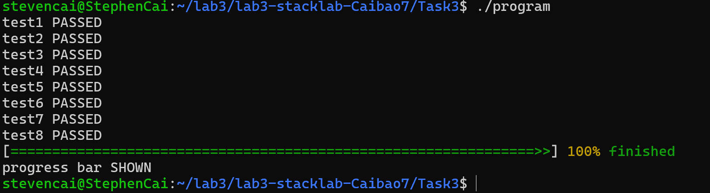

# stacklab 实验报告  
**姓名**：蔡亦扬  
**学号**：23307130258  
## Task 1  
**成功截图**  

**攻击思路**：首先通过阅读汇编代码可以知道栈帧大小是40，希望超出40的部分应该填充我们希望去到的函数的地址。为了避免栈对齐的问题，我们通过阅读eval的汇编码可以知道，应该跳过eval开头的push   %rbp，所以选择跳转的地址是其后一条(0x000000000040121b)。对于输入的字符串，为了只处理"./malware"(而不是只用'A'填充的结果："Executing: ./malwareAAAAAA))")，应该在"./malware"后再加一个"#"来注释掉，这样"./malware"就可以成功在system中进行攻击。  
  
**problem 1.1**：strcpy 和 strcat：这些函数在复制和连接字符串时不检查目标缓冲区的大小，容易导致缓冲区溢出。还有scanf在使用%s格式符时，输入的字符串可能超出目标缓冲区的大小。我还没有在编程中遇到栈溢出的情况。  
  
**problem 1.2**：在调用函数时(call之前)，rsp必须是16字节对齐的，否则会导致Segmentation Fault。然而，调用函数时使用的call指令会将返回地址(8字节)压入栈中，导致rsp减少8字节，这样被调用函数的rsp通常是8字节错位的(rsp % 16 == 8)。接下来在被调用函数内部，往往使用 push rbp 让函数内的rsp回到16字节对齐的状态。system 函数按照调用约定，如果不call它而是直接跳转进去，此时的rsp是16字节对齐的，而它会默认刚进来的情况rsp是8字节错位的，这样就会导致对齐出错。为了确保在调用 system 函数时(刚进system)，栈指针 rsp 满足 rsp % 16 == 8，我们可以让跳转以后的位置是eval中push rbp 指令的下一条，这样eval本身不会push rbp，在call system之前的rsp都还是16字节对齐的。在eval中正常call system，压入返回地址，进入system后是8字节错位的，符合要求，解决了栈对齐的问题。  
## Task 2  
**分析防御机制**：借助objdump静态分析以及查阅资料，这是Canaries的栈保护机制。观察程序新增加的汇编代码，可以发现用这种方式编译后的汇编代码首先在为input开辟的栈多了16，然后加入了读取canary值的过程：  
0x000000000040128f <input+16>:       mov    %fs:0x28,%rax  
0x0000000000401298 <input+25>:       mov    %rax,-0x8(%rbp)  
从%fs:0x28位置读取金丝雀值，并将其存储到当前函数的栈帧中（-0x8(%rbp)）。  
并加入了验证canary值的过程：  
0x0000000000401371 <input+242>:      sub    %fs:0x28,%rdx  
0x000000000040137a <input+251>:      je     0x401381 <input+258>  
0x000000000040137c <input+253>:      call   0x4010f0 <__stack_chk_fail@plt>  
程序将当前%fs:0x28中的金丝雀值与之前保存的-0x8(%rbp)中的金丝雀值进行比较。如果两者相等（je指令跳转），说明金丝雀未被篡改，函数可以安全返回。如果不相等，则调用__stack_chk_fail，触发程序异常终止，防止进一步的攻击。查看Canary是否被修改的函数汇编如下：  
    0x00000000004010f0 <+0>:     endbr64
    0x00000000004010f4 <+4>:     bnd jmp *0x2f35(%rip)        # 0x404030 <__stack_chk_fail@got.plt>
    0x00000000004010fb <+11>:    nopl   0x0(%rax,%rax,1)  
  
**problem 2.1**：不能彻底“防御”栈溢出漏洞。因为攻击者可能能够在不触发canary值检查的情况下利用漏洞(例如，通过覆盖其他非关键数据，如：局部变量)，或者通过某些信息的漏洞提前获取到canary值，从而绕开栈保护机制。  
## Task 3  
**problem 3.1**：内存 -0x4(%rbp) 处存储了 main 函数中的局部变量 i。1217 位置的 mov 指令主要是为了将循环变量 i 的当前值准备好，作为参数传递给 binSearch 函数进行二分查找。  
  
**problem 3.2**：  
好处：可以提高访问速度。register 关键字提示编译器将变量存储在寄存器中，而不是内存。这意味着对这些变量的读写操作可以更快地执行，因为寄存器的访问速度远高于内存。  
不可以直接修改%rip的值到1221而不做其他事情，缺少以下步骤：恢复栈帧(恢复调整%rsp和%rbp)，弹出返回地址。因为ret 指令会从栈中弹出返回地址并跳转到该地址。如果直接修改 %rip，返回地址仍然在栈上，最终可能导致程序崩溃(比如遇到前面讨论过的栈对齐的问题)。此外，函数的返回值通常存储在特定的寄存器中（如 %eax 或 %rax）。直接修改 %rip 无法确保返回值正确传递给调用者，导致主函数无法获取正确的返回结果。 
  
**problem 3.3**：理论上，我认为应该恢复所有相关的寄存器状态。但依据后面的实验情况，最终选择的是rsp, rbp, r12, r13, r14, r15, rbx, rsi, rdi。  
  
**problem 3.4**：如果变量 x 被存放在栈帧上，restore 操作后，x 的值为 1。如果变量 x 被存放在寄存器上，restore 操作后，x 的值为 0。  
  
**problem 3.5**：  
naive_func:  
    endbr64                      
    movq (%rsp), %rax        # 将返回地址从栈顶加载到寄存器 %rax  
    movq %rax, (%rdi)        # 将返回地址存储到第一个参数所指向的内存地址  
    movl $0, %eax            # 将返回值设置为 0  
    ret                      # 返回到调用者  
  
**problem 3.6**：在这个函数中，这些指令不是必要的，因为这个函数不需要使用任何局部变量，也不调用其他函数，因此不需要复杂的栈帧管理。并且由naive_func的汇编代码可以知道，这个函数是可以完成返回到调用者的。  
  
## Task 3.1：  
**save**：首先我们应该考虑要存哪些寄存器的值。选择 rbx, rbp, r12, r13, r14, r15, rsp，是因为它们是 callee-saved 寄存器，调用者可以假设这些寄存器的值在函数返回后保持不变，如果被调用函数需要修改这些寄存器的值，必须在修改前将其值保存。特别的是，rsp此时指向的值是从save返回后的下一条指令的地址，即  
funcA:  
    x = 0  
    save()  
    x = 1  
    call funcB  
  
funcB:  
    restore()  
中x = 1的地址，我们要把这个地址存入内存还需要借助一个寄存器来实现(这里采用先将(%rsp)存入%rax，再将%rax存入对应地址)。把这些值保存好后，设置%rax为0然后ret即可。  
  
**restore**：首先restore会实现将我们之前保存好的值复原，然后将ret_val赋给%rax，再ret即可。因为这时候return回的地址也是我们希望回到的地方(例：x = 1的地址)，并且这个时候save的返回值已经被我们修改成了ret_val(返回值就是%rax的值)，解决了死循环的问题。  
*修改*：为了完成后面的test，对save和restore进行了一定的修改。多保存并恢复了rdi和rsi的值，用于传递参数。  
  
## Task 3.2：  
首先完成 **__err_stk_push** 和 **__err_stk_pop** 这两个基本的操作，push 操作为先建立结点，然后更新 __now_gen->__err_stk_head。pop操作为先保存*ctx，然后更新 __now_gen->__err_stk_head ，之后free原表头即可。  
对于try, catch和throw的宏定义，要利用到Task 3.1写的__ctx_save和__ctx_restore。  
**try**：首先第一句会声明一个 __err_try 变量，并在其生命周期结束时调用 __err_cleanup。__attribute__((cleanup(__err_cleanup))) 会在 try 块结束时自动调用 __err_cleanup，用于弹出栈顶上下文。因此没有throw的情况下，正常完成一次try不会增加异常栈，这符合我们的预期。第一句后(TODO部分)，我们应该创建上下文，压入异常栈，save，根据save的返回值决定后续操作。  
**throw**：考虑到main.c里复杂的括号{}，这里我们考虑用do{}while(0)的方式把函数主体括起来(起到一个保护的作用，要不然编译不过)。然后函数主体部分是异常栈的出栈，然后restore。  
*修改*：新加入了一段返回caller的代码，后面Task 3.3有提及。  
**__err_cleanup**：如果没有throw，也就是try块正常结束，原本try会push一次，所以这里要pop出来。正常结束的标志就是save的返回值(赋给了err_try)为0。  
**catch**：因为throw的restore会导致try中的save的返回值非0，这样根据try最后的判断条件，不会进入if分支，所以catch部分的代码写一个else即可(注意不需要括号{}，main.c里面括号都写好了)。  
  
## Task 3.3：  
**generator**：分配空间后，对f, data, caller, __err_stk_head先作初始化。然后初始化栈，选择4096的栈的大小，并使其对齐16字节。接着是完成__ctx：经过不断尝试，还是觉得应该把参数都放进ctx里进行储存，比如函数指针f和参数arg被存储在寄存器rdi和rsi中，还有(rsp)对应的返回地址，被存在了ret中。结构内应该8字节对齐。故context_asm里面也要做相应的修改，要在save里把(%rsp), rdi, rsi存好，在restore里把这些值复原，位置和结构里的偏移都是一一对应的。  
**plank**：跳板函数。  
**send**：gen != 0的情况下，现将参数value赋给gen->data，然后根据save的返回值判断这是第一次save还是由restore传来的，如果是第一次save，那么当前执行上下文即将切换，将当前__now_gen更新为目标生成器gen，并调用__ctx_restore(&(__now_gen->ctx), 1)恢复目标生成器的上下文。这样将程序的执行切换到目标生成器，使其从上一次挂起的yield位置继续执行。如果是由restore传回来的那就返回gen->data。  
**yield**：他的主要作用是在生成器内部挂起执行，并将一个值返回给调用者，同时保存生成器的当前上下文以便后续恢复。与send逻辑基本相同，yield使用的是__now_gen。  
**throw**：发现有一个问题没有处理，即测试中就是嵌套的error无法被捕捉到，因此需要对throw进行修改：throw宏首先进入一个do-while循环，检查当前活动生成器__now_gen的异常处理栈__err_stk_head是否为空。如果为空，则将__now_gen更新为其调用者生成器__now_gen->caller，继续向上查找，直到找到一个非空的异常处理上下文或到达主生成器。  
  
## Task 3.4：  
进度条的实现还是比较简单的，只需要在progress还没到64时(progress的更新已有)一直循环打印即可。根据progress的大小打印已覆盖部分，用=>>表示，其余部分用#表示。根据progress的值还在最后设计了一个会动态闪烁的waiting。  
  
**成功截图**：  
