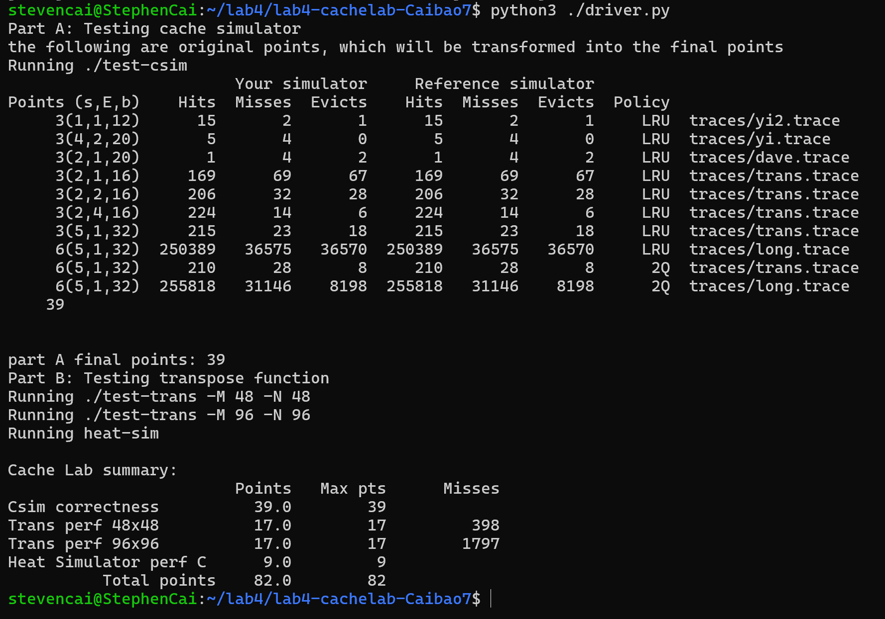

# cache lab 实验报告  
**姓名**：Caibao7  
## 成功截图  

## part A  
### **LRU策略**：  
1. 在csim.h中定义好全局变量和cache的结构。一开始为了实现LRU策略，结构除了要存储tag和valid位以外，只有一个时间戳stamp，用于记录每个块最后被访问的时间。
2. 在csim.c中，首先初始化cache，将所有块的valid位设为0，时间戳设为0。接着在update函数里，先计算组索引和标签。由于此lab定义的小s和小b和书上不同，因此计算方式也不同，不能直接像书上一样使用位运算。我考虑先将cache视作广义上的“行”的集合，block_num即为对应“行”的索引，再依据block_num来分配组和标签。组索引如果超过S - 1要对标签进行补偿。  
3. 接着依次检查hit, miss, miss并且需要evict的情况，分别递增hit, miss, eviction即可。  
4. 更新时间戳函数update_stamp  
5. parse_trace函数可以解析文件的每行内容。对于'M'本质上就是执行两次update。最后都应该update_stamp  
6. main函数中，通过getopt函数来获取命令行参数，然后调用parse_trace函数来解析文件。
### **2Q策略**：  
1. 首先在csim.h中定义好2Q队列节点和2Q队列结构，还有每个set的2Q队列结构(A1_in和Am)。需要更改之前的cache结构，使其包含二维数组和set的2Q队列结构。  
2. 完成初始化队列、入队、出队、检查tag是否在队列中的函数。  
3. 在初始化cache中，现在应该在policy为1(2Q)时，初始化每个set的2Q队列结构。  
4. 在update函数中，根据policy来选择LRU和2Q策略。2Q策略首先该组的队列的Am中有没有这个tag，有的话先移除再入队(就是移动到队尾)，这样是hit；没有的话就检查这个组的A1_in中有没有，有的话就从A1_in出队然后入Am，这样是miss，如果Am超容量也驱逐最旧的；都没有的话就要插入A1_in，未满直接插入，满了驱逐最旧的。   
### 问题：  
请你思考，相对于LRU的替换策略，为什么2Q有以上优点却没有被大规模使用。  
**答案**：  
1. 实现复杂性较高：2Q 需要维护两个独立的队列（A1-in 和 Am）。需要额外的逻辑来管理数据在两个队列之间的迁移，这相比于 LRU 的计数器实现更为复杂。  
2. 硬件层面：实现 2Q 的两个队列以及相应的管理逻辑比实现 LRU 更为困难和成本更高，也需要更多的内存和计算资源。复杂的替换策略可能导致延迟增加。  
3. 收益有限：LRU 已经能够提供足够的性能。对于大多数场景而言，2Q 带来的性能提升并不足以弥补其增加的复杂性和成本。  
3. 后续维护和扩展比较困难。  
## part B  
### **48*48的矩阵转置**：  
由于cache的行大小为12(可以存12个int)，所以将矩阵分块，每块大小为12*12。对于每个块，先把A按行复制给B。A 是在每对 12 个 int 操作时，会不命中一次，即每个块中有且只有一个元素不被命中，这是无法避免的。在分块复制完成后，再在B分块里面完成转置。这个方法消除了所有的两个矩阵之间的缓存冲突。  
### **96*96的矩阵转置**：  
不同于上一种情况，此时冲突不光在输入输出矩阵的主对角线上，连同一个区块的上下两半部分都是冲突的。  
依然，将矩阵划分为 12×12 的块，每次处理一个块区域。遍历整个矩阵。  
对于**对角线块**(jj == ii)，首先将矩阵的前六行元素从矩阵 A 复制到矩阵 B，然后对这些元素进行转置，以避免缓存冲突。  
通过交换操作，将上半部分与下半部分的元素互换，确保数据在缓存中的局部性，从而减少缓存未命中。  
对于**非对角线块**，直接按行复制元素，从源矩阵 A 到目标矩阵 B，利用临时变量(a0 到 a11)存储中间数据。  
**块内转置优化**：  
在每个 12×12 块内部，进一步细分为 6×6 的子块，分别对上半部分和下半部分进行转置操作。  
## part C  
### **miss变化情况**：  
miss不变。因为：缓存块太小，无法容纳足够的数据。当算法处理每一行数据时，每次访问一个元素都会导致新的缓存块被加载，而之前加载的块很快被替换出缓存。因此，无论cache的E如何变化，miss的次数都不变。  
### **heat_sim**：    
示例代码显然是cache不友好的代码。思考改进方式的时候我看到了part B中的“你不能使用malloc等方式申请内存块。你可以使用int数组，但等同于数组大小的数量的int类型变量也同样被计入。”既然这个part没有这个要求，那我就考虑能否使用缓冲块来优化。  
首先申请到两个大小为N的缓冲块current 和 next。current存的是当前温度t下的行，next是由current计算出的t+1下的行。然后再将next赋给矩阵A(也是对应t+1下的行)。最后将next和current交换，重复即可。这样我们每次都是一行一行处理，减少缓存冲突。这份代码就直接通过了。  
## 参考资料  
知乎《CSAPP - Cache Lab的更(最)优秀的解法》，作者NFLS-CHINA。https://zhuanlan.zhihu.com/p/387662272
